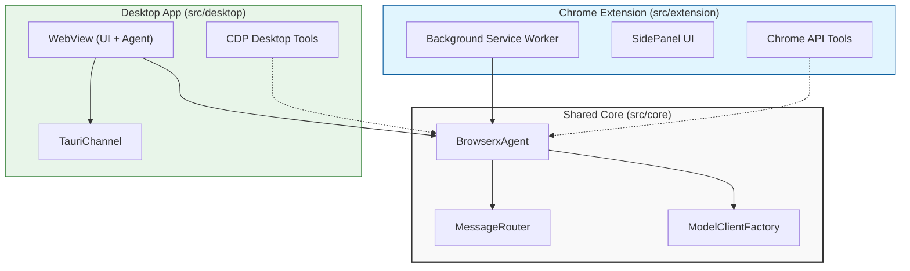

# Browserx Architecture Overview

This document outlines the "One Core, Two Shells" architecture used in the application.

## High-Level Architecture

The project is structured to share the core "brain" (agent logic) while using platform-specific "shells" for the environment (Chrome Extension vs. Desktop App).

### Directory Structure

- **`src/core`**: The shared brain. Contains the `BrowserxAgent`, `ModelClient`, and protocol definitions. This code is platform-agnostic.
- **`src/extension`**: The Chrome Extension shell. Runs in a Background Service Worker context.
- **`src/desktop`**: The Desktop shell (Tauri). Runs in a single WebView process.

### System Diagram

---

## Desktop Architecture Specifics

The Desktop application is built using **Tauri v2**. Unlike the extension which is distributed across processes (background script vs. content script vs. popup), the desktop app runs primarily in a single **WebView** process context for the UI and the Agent.

### 1. Initialization Flow
Located in `src/desktop/ui/main.ts`:
1.  **Boot**: Svelte app initializes.
2.  **Bootstrap**: Calls `initializeDesktopAgent()`.
3.  **Agent Creation**: `DesktopAgentBootstrap` creates the `BrowserxAgent` instance directly in the UI memory space.
4.  **Auth Sync**: `DesktopAuthService` checks the OS Keychain for tokens and signals the agent.

### 2. The "In-Process" Agent
*   **Location**: The Agent lives in the same memory space as the UI.
*   **Communication**: Instead of `chrome.runtime.sendMessage`, we use `TauriChannel`. This acts as a local "loopback" to route messages, tricking the core agent into thinking it's communicating over a channel, preserving the message-passing architecture.

### 3. Authentication (Deep Link Flow)
*   **Login**: User clicks login -> Browser opens -> Redirects to `airepublic-pi://auth/callback`.
*   **Deep Link**: OS wakes up the app.
*   **Handler**: `DesktopAuthService` catches the URL, extracts tokens (`access_token`, `refresh_token`), and saves them to the **OS Keychain** using `keytar`.
*   **Bootstrap**: Listens for the change and updates the agent's `AuthManager`.

### 4. Tool Differences
| Feature | Chrome Extension | Desktop App |
| :--- | :--- | :--- |
| **DOM Access** | `chrome.tabs`, `chrome.scripting` | Chrome DevTools Protocol (CDP) |
| **Storage** | `chrome.storage.local` | `window.localStorage` + OS File System |
| **Navigation** | `chrome.tabs.update` | CDP Navigation |

The file `src/tools/registerPlatformTools.ts` is the traffic cop that decides which set of tools to load based on the `__BUILD_MODE__`.
